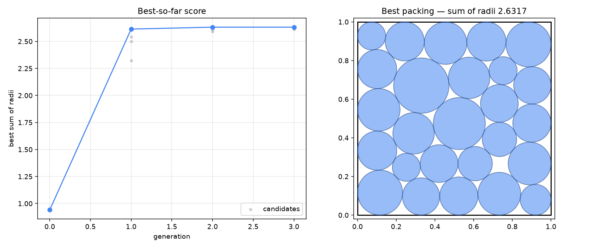

# evoloop

A working reimplementation of the AlphaEvolve loop over the **circle packing**
example from [`alphaevolve-on-googlecloud`](https://github.com/Google-Cloud-AI/alphaevolve-on-googlecloud)
— same seed program, same metric — but with the generation half pluggable, so it
runs without a Gemini Enterprise subscription.

**Result of the run in `state/db.json`:** seed `0.941455` → best `2.631730` over
3 generations and 18 evaluated programs (+179.5%). The published AlphaEvolve
result for n=26 is ≈ `2.635`.



## Why this exists

The upstream repo's generation half is a managed Google Cloud service reached
through the Discovery Engine API, which requires a provisioned **Gemini
Enterprise** app. That is a paid enterprise product. This project keeps the
upstream seed and scoring semantics and swaps in a generator you control.

## The loop

Four pieces, mirroring the AlphaEvolve architecture:

| Piece | Here | Upstream |
|---|---|---|
| Program database | `alphaevolve/database.py` — islands, tournament selection, migration | managed service |
| Prompt sampler | `alphaevolve/prompts.py` — parent + inspirations + recalled failures | managed service |
| Generator | `alphaevolve/generators.py` — Claude, or file-backed | Gemini ensemble |
| Evaluator | `alphaevolve/evaluator.py` — subprocess, resource-limited | your code (same) |

Only the evolvable region of `seed/program.py` — between the `EVOLVE-BLOCK-START`
and `EVOLVE-BLOCK-END` markers — is ever replaced. The protected `evaluate()` and
`_circles_overlap()` below the marker are exactly the upstream ones, so a score
here is comparable to a score there.

## Running it

```bash
uv venv .venv && uv pip install --python .venv/bin/python numpy scipy matplotlib anthropic
```

### With Claude driving generation

Needs a credential — `ANTHROPIC_API_KEY`, or an `ant auth login` profile:

```bash
.venv/bin/python run_evolution.py init
.venv/bin/python run_evolution.py run --generations 10 --children 4
.venv/bin/python run_evolution.py report
```

Uses `claude-opus-5` with adaptive thinking at `high` effort. Note there is no
`temperature` knob — it is rejected on Claude Opus 5 and Sonnet 5 — so population
diversity comes from the resampled prompt each child gets, not from sampling
settings.

### Without any credential

`--generator manual` writes each child's prompt to `manual/<tag>.prompt.md` and
waits for you to drop the model's reply in `manual/<tag>.response.md`. Rerun the
same command once the responses exist and it evaluates them and records the
generation. This is how the run in `state/db.json` was produced.

```bash
.venv/bin/python run_evolution.py step --generator manual --children 4
```

## Evaluation and safety

Candidate code is model-written, so `evaluate_program` runs it in a separate
process with `RLIMIT_CPU` (50s), `RLIMIT_AS` (4GB), no core dumps, and a 60s
wall-clock kill.

BLAS is pinned to one thread. This matters: `RLIMIT_CPU` sums CPU across *all*
threads, so multithreaded numpy made candidates that budgeted ~19s of wall clock
die on a 25s CPU limit after a few seconds. Three of four candidates in the first
attempt at generation 2 were killed this way — a harness bug, not bad candidates.

Failures return a sentinel score **and an insight string** naming the specific
violation ("circles 7 and 19 overlap by 3.4e-03…"), which is fed into the next
generation's prompt. Uninformative insights are wasted feedback: `exit code -9`
tells the model nothing, so signal deaths are reported as resource-limit kills.

## What the run showed

- **Generation 1 did nearly all the work** — 0.94 → 2.61. The seed's weakness was
  structural: it computed radii by greedy pairwise scale-down. Every strong
  candidate replaced that with the observation that *for fixed centres,
  maximising the sum of radii is a linear program*.
- **Generation 2 refined**: joint SLSQP over all `3n` variables with analytic
  Jacobians, then basin hopping around the incumbent → 2.6317.
- **Generation 3 plateaued.** Nothing beat generation 2, and the annealed variant
  scored *below* its own parent. Expected — progress is non-monotonic, and a
  plateau is not a reason to stop a real run.

## Layout

```
seed/program.py        upstream seed, unmodified
alphaevolve/           database, prompts, generators, evaluator, worker
run_evolution.py       init | step | run | report
state/db.json          every program evaluated, with scores and lineage
manual/                per-child prompts and responses
report/                best_program.py and evolution.png
```

## License

Apache License 2.0 — see [LICENSE](LICENSE).

`seed/program.py` is Google's, taken unmodified from
[alphaevolve-on-googlecloud](https://github.com/Google-Cloud-AI/alphaevolve-on-googlecloud)
and used under the same license; see [NOTICE](NOTICE) for the attribution. The
rest of the code here is an independent implementation.
